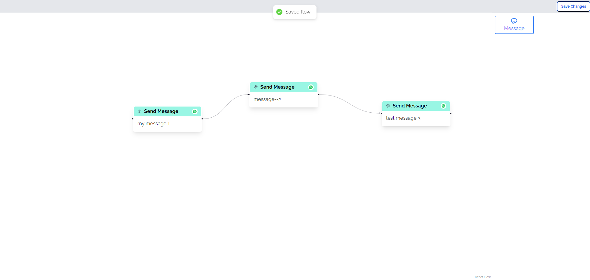

# ChatBot

A chatbot flow is built by connecting multiple messages together to decide the
order of execution.

## Built with

- [Shadcn/ui](https://ui.shadcn.com/)
- [Zustand](https://zustand-demo.pmnd.rs/)
- [Vite](https://vitejs.dev/guide/)
- [React hot toast](https://react-hot-toast.com/docs)
- [Tailwind](https://tailwindcss.com/)
- [Reactflow](https://reactflow.dev/)
- [pnpm](https://pnpm.io/)

## Installation

1.  Clone repository

```bash
git clone https://github.com/Shwetzksk/chatbot-flow-app.git
```

2 Install packages

```bash
pnpm i
```

3.  Run locally

```bash
pnpm run dev
```

## Functionality

### Add nodes to flow by dragging & dropping node from the node pannel


### More nodes with empty target handles, then it throw this error

#### Case 1:


#### Case 2:


#### Case 4: If node is selected, then it will just save node message text


### Settings Panel will replace the Nodes Panel when a Node is selected


### Click on button to save flow



### UI is responsive


